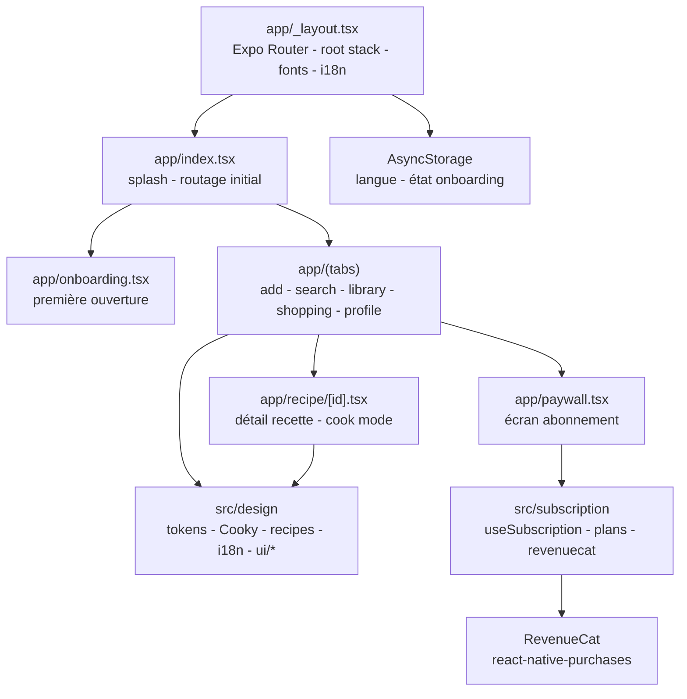

# Let Me Cook - app mobile iOS + Android

[](https://github.com/Adam-Blf/let-me-cook/releases)

<!-- adam-badges:start -->
[](https://github.com/Adam-Blf/let-me-cook/commits) [](https://hits.sh/github.com/Adam-Blf/let-me-cook/) [](https://github.com/Adam-Blf/let-me-cook/commits) [](https://github.com/Adam-Blf/let-me-cook) [](LICENSE)
<!-- adam-badges:end -->

App Expo React Native qui extrait des recettes depuis des vidéos, photos
et articles partagés (TikTok, Reels, YouTube Shorts, Facebook,
Pinterest, blogs, livres). Mascotte : **Cooky**, le petit chef.

- Proto web de référence : https://let-me-cook-lyart.vercel.app
- Source design : `C:\Users\adamb\let-me-cook\`

## Architecture



## Stack

- Expo SDK 54 - React Native 0.81 - React 19
- TypeScript 5.9 strict
- Expo Router v6 (file-based routing)
- react-native-svg (mascotte Cooky)
- expo-linear-gradient (overlays, food placeholders)
- @react-native-async-storage/async-storage (lang, onboarding state)
- @expo-google-fonts (Instrument Serif, Geist, Geist Mono)

## Lancer en dev

```bash
cd C:\Users\adamb\let-me-cook-app
npm run start          # ouvre Metro bundler
```

Puis :

- **iPhone sans store, gratuit** : installe Expo Go sur ton iPhone depuis l'App Store une fois, scanne le QR code qui s'affiche dans le terminal. L'app tourne dans Expo Go - aucun build, aucun certif.
- **Android sans store, gratuit** : pareil avec Expo Go sur Google Play.
- **Simulateur Android** (Windows) : `npm run android` (demande Android Studio installé).

## Installer sur iPhone sans passer par l'App Store

Trois options, du plus simple au plus lourd.

### 1. Expo Go (recommandé, zéro config)

1. Sur iPhone, installe **Expo Go** (https://apps.apple.com/app/expo-go/id982107779).
2. Sur PC : `npm run start`.
3. Scanne le QR avec l'appareil photo iOS - l'app s'ouvre dans Expo Go.
4. Partage le lien Expo (ex. `exp://192.168.x.x:8081`) à des testeurs sur ton WiFi.

Limite : Expo Go héberge ton JS, pas une vraie app native. Les intent
filters Android et share extensions iOS définis dans `app.json` ne
s'activent qu'en dev/production build.

### 2. Development build - EAS internal distribution (1 build iOS)

Pour tester la vraie app (avec partage système, caméra, icône sur
l'écran d'accueil) sans passer par le Store :

```bash
npx eas login
npx eas build --platform ios --profile development
```

EAS construit un `.ipa` signé via un compte Apple Developer
(**99 $/an**, obligatoire pour signer iOS). Tu reçois un lien -
TestFlight le distribue aux testeurs (jusqu'à 10 000 personnes, 90
jours). Aucun passage par l'App Store Review pour la TestFlight
interne (Apple valide juste le beta, 24-48h).

Sans compte Apple Developer, impossible d'installer un `.ipa` sur un
iPhone stock. Seul contournement gratuit : sideload via AltStore /
Sideloadly avec un Apple ID gratuit (validité 7 jours, à re-signer
chaque semaine depuis le Mac/PC). Pénible.

### 3. Production build - EAS submit to App Store

```bash
npx eas build --platform ios --profile production
npx eas submit --platform ios
```

Cette fois l'app passe l'App Store Review (~24-72h).

### Android sans Play Store

Beaucoup plus simple :

```bash
npx eas build --platform android --profile preview
```

Retourne une URL `.apk` - tu ouvres le lien sur le téléphone Android,
autorises "sources inconnues", installes. Zéro frais Google (Play
Console c'est 25 $ à vie si tu veux publier sur Play).

## Arborescence

```
let-me-cook-app/
  app/                           - expo-router (file-based)
    _layout.tsx                  - root stack + fonts + lang provider
    index.tsx                    - Splash
    onboarding.tsx               - 3 étapes
    (tabs)/
      _layout.tsx                - tab bar (5 onglets)
      library.tsx                - bibliothèque (hero + grid)
      search.tsx                 - stub
      add.tsx                    - source picker
      shopping.tsx               - stub
      profile.tsx                - profil + toggle FR/EN
    recipe/[id].tsx              - détail recette
  src/
    design/
      tokens.ts                  - palette, typo
      i18n.tsx                   - FR / EN + useLang hook
      recipes.ts                 - seed data 8 recettes
      Cooky.tsx                  - mascotte SVG (7 poses)
      ui/
        Button.tsx               - 4 variants
        Chip.tsx                 - filtre
        Eyebrow.tsx              - label mono
        FoodPlaceholder.tsx      - gradient tone
        KcalBadge.tsx            - badge kcal
        ScreenStub.tsx           - placeholder
  app.json                       - config iOS + Android (bundle, intents)
  eas.json                       - build profiles (dev / preview / prod)
```

## Scripts

| Commande | Rôle |
|----------|------|
| `npm run start` | Metro + QR Expo Go |
| `npm run ios` | Simulateur iOS (Mac only) |
| `npm run android` | Émulateur Android |
| `npm run typecheck` | `tsc --noEmit` |
| `npm run build:ios` | EAS build profile preview |
| `npm run build:android` | EAS build APK preview |
| `npm run submit:ios` | Push App Store |
| `npm run submit:android` | Push Play Store |

## Ce qui est porté vs ce qui reste

**Portés bout en bout (design pixel-perfect)**
- Splash - Onboarding ×3 - Library (hero + grid)
- Recipe detail (ingrédients + étapes + timers)
- Source picker (+ Nouvelle) - Profile (toggle lang)
- Système : tokens, i18n FR/EN persisté, Cooky 7 poses, tous les UI
  primitives (Button, Chip, KcalBadge, FoodPlaceholder, Eyebrow)

**À porter - `TODO.md`**
- Share sheet system (trigger depuis intent filter Android)
- Photo mode - caméra (expo-camera)
- Extraction loader (progression réelle quand backend branché)
- Cook mode mains libres - Finished - Ingredient detail
- Search (fuzzy sur titre/ingrédients)
- Shopping list groupée par rayon
- Recipe editor (manuel) - Nutrition (kcal + macros)

**Backend (hors scope frontend)**
- Pipeline d'extraction : yt-dlp (download) - Whisper (transcription) -
  LLM (structuring) - USDA/CIQUAL API (calories)
- Auth + stockage Supabase
- Recette vers bibliothèque utilisateur (sync cross-device)

## Déploiement stores (résumé)

- **Apple Developer Program** - 99 $/an - indispensable pour signer iOS
  hors jailbreak - compte à ouvrir sur developer.apple.com avec ton
  Apple ID `adam.beloucif@efrei.net`.
- **Google Play Console** - 25 $ unique - play.google.com/console.
- Remplace dans `eas.json` les `REPLACE_WITH_*` par les IDs réels après
  création des fiches sur App Store Connect et Play Console.
- iOS - bundle `com.adambeloucif.letmecook` - Android - package idem.

 <picture>
 </picture>
</a>
